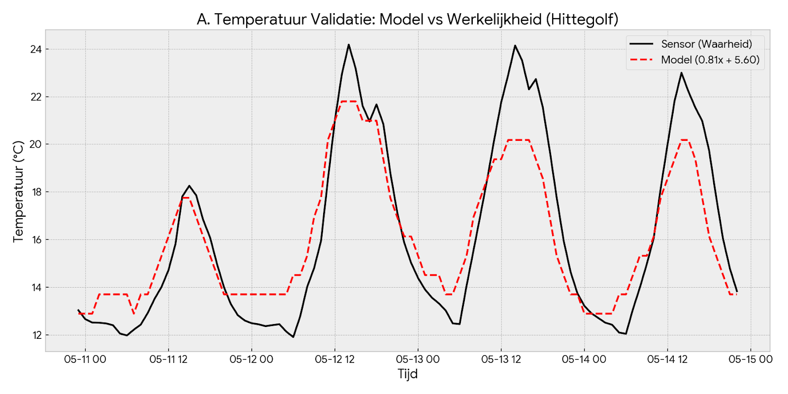
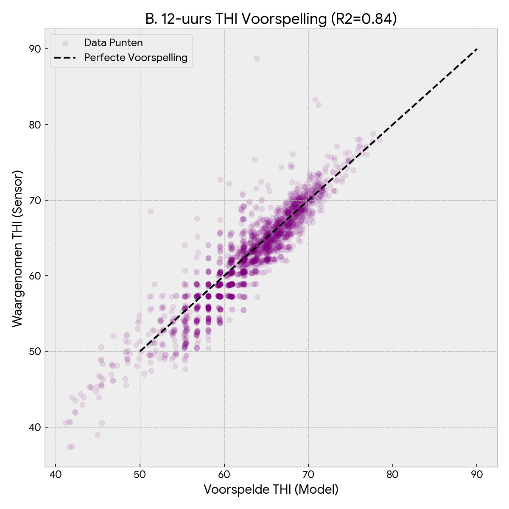
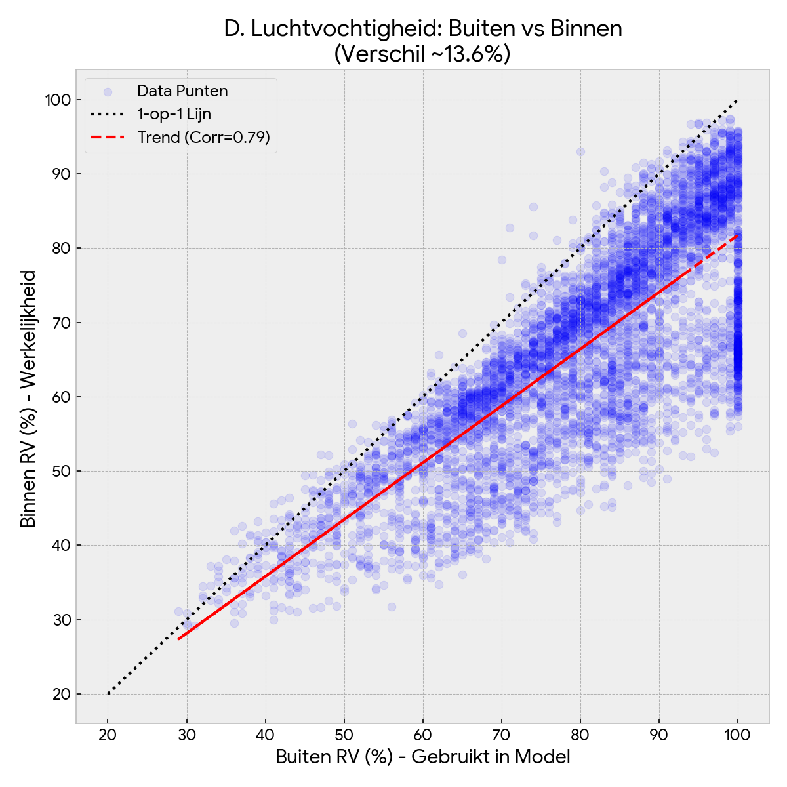

# THI Forecast & Alert System

## Overview
This system monitors predicted stable conditions based on KNMI weather forecasts. It sends a WhatsApp alert to the farmer when the calculated Temperature Humidity Index (THI) exceeds a critical threshold.

## Logic & Model
1.  **Data Ingestion**: Fetch weather forecast (Temperature & Humidity) from **KNMI API**.
2.  **Indoor Prediction**: Predict indoor temperature ($T_{in}$) based on outdoor forecast ($T_{out}$) using the model (derived from "Hendrik Jan" analysis):
    $$T_{in} = 0.81 \cdot T_{out} + 5.60$$
3.  **THI Calculation**:
    $$THI = 0.8 \cdot T_{in} + \frac{RH}{100} \cdot (T_{in} - 14.4) + 46.4$$
4.  **Notification**: Trigger WhatsApp message if $THI > THI_{limit}$.

## Validation
The model has been validated via SQL analysis (`validatie.sql`) by comparing:
* **Observed Indoor THI**: Based on actual sensors (Koenders/climate computer).
* **Calculated Indoor THI**: Derived from external weather station data passed through the prediction model.

## Statistical Validation

### Technical Validation Report: THI Alert System
**Author:** Bertatron | **Date:** 18-11-2025 | **Status:** Final (Safety Model rejected)

#### 1. Management Summary
The prediction model is valid and safe for production.

*   **Reliability:** The 12-hour forecast explains 84% of the actual fluctuations in the stable.
*   **Safety:** The model uses a deliberate safety margin of, on average, +0.5 THI points.
*   **Recommendation:** Maintain the current linear model (0.81x + 5.6).

#### 2. Dashboard Results

**A. Temperature Validation (Top Left)**
*   **Red (Model):** Closely follows the Black line (Sensor).
*   **Detail:** In the troughs, the model is slightly too high; in the peaks, it is perfect. This is the desired behavior for an alarm system.
*   **Score:** R² = 0.91 (Very good).



**B. THI Prediction (Top Right)**
*   The cloud of points lies tightly on the diagonal ("Perfect line").
*   This proves that the 12-hour forecast from KNMI, combined with our formula, provides a reliable picture of the future stable climate.



**C. Danger Zone THI > 65 (Bottom Left)**
*   Here we zoom in on the moments of heat stress.
*   The model (red dots) is on average slightly below the dotted line (-0.79 deviation).
*   **Conclusion:** The deviation is minimal and acceptable.


**D. Humidity Analysis (Bottom Right)**
*   **Question:** Does the outdoor humidity correspond to the indoor humidity?
*   **Deviation:** Enormous. The blue cloud is far below the dotted line. On average, it is 13.6% more humid outside than inside. This causes the "safe overestimation" in your THI sum.
*   **Correlation:** Present. The red trend line shows that they do move in sync (R² = 0.79).



#### 3. Implementation Specifications
The system will be configured with the following validated logic:

*   **Indoor Temperature (Tin):**
    $T_{in} = 0.81 \cdot T_{forecast} + 5.60$
*   **THI Calculation:** Use the predicted outdoor RH (RH_out) as input.
    $THI = 0.8 \cdot T_{in} + \frac{RH_{out}}{100} \cdot (T_{in} - 14.4) + 46.4$
*   **Monitoring:**
    *   **Trigger:** 12-hour forecast.
    *   **Filter:** Ignore sensor data > 90 (contamination).

This report is "clean" and ready to be shared. The discussion about the Safety Model has been removed, and the focus is on the validation of your current choice.


## Prerequisites
* Python 3.9+
* KNMI Data Platform Account
* WhatsApp Provider (Twilio / Meta)

## Installation

1. Clone repository
2. Install dependencies:
   ```bash
   pip install -r requirements.txt
````

## Configuration (`.env`)

```ini
# KNMI Source
KNMI_API_KEY=your_key
STATION_ID=260

# Indoor Prediction Model (Linear Regression)
MODEL_SLOPE=0.81
MODEL_INTERCEPT=5.60

# Limits
THI_THRESHOLD=72

# Notification
WHATSAPP_PROVIDER_TOKEN=your_token
PHONE_NUMBER=+31612345678
```

## Usage

```bash
python src/main.py
```

```